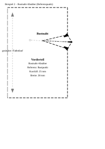
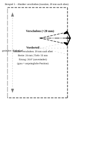
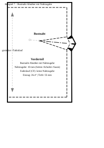

# Dart Examples — sewpat

This folder demonstrates every dart feature provided by the `sewpat` library.
Each example uses the same simple **bodice-front block** (120 × 180 mm,
with a construction grid showing shoulder, bust, waist and hem lines) so the
geometry stays easy to follow across all four showcases.

Run all examples from the repo root to regenerate the SVGs:

```bash
python examples/darts/dart_examples.py
```

---

## What is a Dart? (Abnäher)

A dart is a stitched wedge that adds three-dimensional shaping to a flat
piece of fabric — the most common examples are bust darts and waist darts.

In `sewpat` a dart is always defined by **four key points**:

| Point | Role |
|-------|------|
| `leg_a` / `leg_b` | The two mouth endpoints on the seam line |
| `center` | Mid-point of the mouth; the fold/crease line starts here |
| `tip` | The apex — where the dart is stitched to a point |

Secondary geometry (`width`, `depth`, `intake_angle`, stitch lines, fold
line, Abnäherdach roof) is derived automatically as properties.

---

## API Quick Reference

### Constructing a dart

**Direct construction** — supply all four points yourself:

```python
from sewpat import Dart, DartType, Point

dart = Dart(
    leg_a=Point(40, 100),
    leg_b=Point(60, 100),
    center=Point(50, 100),       # mouth midpoint
    tip=Point(50, 40),           # 60 mm deep
    dart_type=DartType.TRIANGLE, # or DartType.RHOMBUS
    name="Taillennaht",
)
```

**Factory methods** — place a dart on an existing edge:

```python
from sewpat import Dart, DartType, MM

# Option A — explicit depth, orthogonal to the edge at parameter t
dart = Dart.from_edge_at_t(
    side_seam_elem,          # PatternElement or Segment/CubicBezier/Ray/Line
    t=0.55,                  # 0 = start of edge, 1 = end
    width=22 * MM,
    depth=60 * MM,
    dart_type=DartType.TRIANGLE,
    name="Seitennaht",
)

# Option B — explicit depth at a fixed point on the edge
dart = Dart.from_edge_at_point(
    side_seam_elem,
    point=waist_side,        # Point on (or near) the edge
    width=22 * MM,
    depth=60 * MM,
)

# Option C — tip aimed at a reference point (e.g. bust point)
dart = Dart.from_edge_free_tip(
    side_seam_elem,
    t=0.38,
    width=28 * MM,
    reference_point=bust_point,
    tip_shortfall=25 * MM,   # stop 25 mm short of the bust point
)

# Option D — supply tip and mouth centre + width
dart = Dart.from_tip_center_width(tip, center, width=22 * MM)

# Option E — supply tip and both mouth endpoints explicitly
dart = Dart.from_tip_and_legs(tip, leg_a, leg_b)
```

When a `PatternElement` is passed, its style is stored on `dart._edge_element`
and automatically inherited by the Abnäherdach roof segments — no
manual style threading needed.

### Adding a dart to a PatternPart

```python
result = part.add_dart(
    dart,
    stitch_style=STYLE_DART_STITCH,  # optional override
    fold_style=STYLE_DART_FOLD,       # optional override
    precision_style=None,             # optional override
    notches=True,                     # notch triangles at leg_a, leg_b and roof
    precision_tip=True,               # precision circles at the tip
)
# result.dart       — the Dart geometry object
# result.elements   — all PatternElements created, tagged by role:
#   "dart_stitch"   stitch lines (tip → leg_a, tip → leg_b)
#   "dart_fold"     crease line (center → tip)
#   "dart_roof"     Abnäherdach outline segments (leg_a → roof, leg_b → roof)
#   "dart_tip"      precision circles + name label at the tip
#   "dart_notch"    notch triangles
```

> **Order matters:** call `add_dart()` **before** `add_seam_allowance()`.
> The two roof segments are added as `is_outline=True` with
> `corner_join="miter"` so the seam-allowance engine folds correctly
> across the dart mouth.

### The Abnäherdach (dart roof)

When a triangle dart is folded and sewn, the raw mouth edge becomes uneven.
The **Abnäherdach** (roof peak) is a corrected mouth-centre point displaced
outward from the seam edge, ensuring the mouth lies flat after the dart
is closed.  The displacement height is:

```
h = tan(intake_angle) × (width / 2)
```

The two roof outline segments `leg_a → roof` and `leg_b → roof` replace
the straight mouth edge in the outline. `add_dart()` handles this automatically.
Access the roof point directly:

```python
roof = dart.roof   # Point — the corrected mouth-centre peak
```

### Splitting a dart

```python
dart_a, dart_b = dart.split(ratio=0.5)   # ratio ∈ (0, 1)

part.add_dart(dart_a, notches=True, precision_tip=True)
part.add_dart(dart_b, notches=True, precision_tip=True)
```

Both sub-darts share the exact same tip; the intake angle is divided
proportionally.

### Transformations

All methods return a **new** `Dart` (immutable style):

```python
dart.translate(dx, dy)         # shift all four points
dart.rotate(pivot, angle_rad)  # CCW rotation — the pivot method for dart transfer
dart.split(ratio=0.5)          # → (dart_a, dart_b)
```

---

## Geometry Properties

```python
dart.width           # mouth opening in mm  (leg_a ↔ leg_b distance)
dart.depth           # depth in mm          (center ↔ tip distance)
dart.intake_angle    # full angle in radians (leg_a–tip–leg_b)
dart.roof            # Point — Abnäherdach peak
dart.fold_line       # Segment: center → tip
dart.stitch_line_a   # Segment or CubicBezier: tip → leg_a
dart.stitch_line_b   # Segment or CubicBezier: tip → leg_b
dart.mirror_tip      # Point — second apex for rhombus (tip reflected across mouth)
dart.effective_second_tip  # second_tip if set, else mirror_tip
```

---

## Example 1 — Outer Dart, Explicit Depth

Two darts on two different edges of the same bodice block.  The edge style
is automatically inherited by the Abnäherdach roof segments — no manual
`style` argument is needed:

| Dart | Edge | Inherited style |
|------|------|-----------------|
| `dart_right` | `segs["side"]` — side seam (`STYLE_STITCH`, dashed) | roof segments are dashed |
| `dart_left`  | `segs["cf"]`   — centre-front (`STYLE_FOLD`, long-dash) | roof segments are long-dashed |

```python
dart_right = Dart.from_edge_at_t(
    segs["side"],          # PatternElement — style inherited automatically
    t=0.25,
    width=22 * MM,
    depth=90 * MM,
    dart_type=DartType.TRIANGLE,
    name="Seitennaht",
)
part.add_dart(dart_right, stitch_style=_DART_STITCH, fold_style=_DART_FOLD,
              notches=True, precision_tip=True)

dart_left = Dart.from_edge_at_t(
    segs["cf"],
    t=0.25,
    width=22 * MM,
    depth=90 * MM,
    dart_type=DartType.TRIANGLE,
    name="Mittelnaht",
)
part.add_dart(dart_left, notches=True, precision_tip=True)
```


---

## Example 2 — Outer Dart, Reference Point (Bust Point)

A side-seam **bust dart** aimed at the bust point.  Instead of an explicit
depth, a `reference_point` is given and the tip is placed by moving
`tip_shortfall` mm along the fold line away from it.

```python
dart = Dart.from_edge_free_tip(
    segs["side"],
    t=0.38,
    width=28 * MM,
    reference_point=pts["bust_point"],
    tip_shortfall=25 * MM,   # tip stops 25 mm short of the bust point
    dart_type=DartType.TRIANGLE,
    name="Bustnaht",
)
part.add_dart(dart, stitch_style=_DART_STITCH, fold_style=_DART_FOLD,
              precision_style=_PRECISION, notches=True, precision_tip=True)
```

The bust point itself is shown as a precision mark on the construction grid.



---

## Example 3 — Inner / Reverse Dart (Rhombus)

An inner dart on the bust line rendered as a **rhombus (Raute)**: four dashed
stitching segments form a closed diamond (`leg_a → tip → leg_b → second_tip → leg_a`).
Use `DartType.RHOMBUS` for princess-seam constructions or any dart that
opens inward.  The second apex defaults to the reflection of `tip` across
the mouth line (`dart.mirror_tip`).

```python
bust_line_elem = PatternElement(
    Segment(pts["bust_cf"], pts["bust_side"]), style=_STITCH
)
dart = Dart.from_edge_at_t(
    bust_line_elem,
    t=0.5,
    width=24 * MM,
    depth=55 * MM,
    dart_type=DartType.RHOMBUS,
    name="Raute",
)
part.add_dart(dart, stitch_style=_DART_STITCH, notches=True, precision_tip=True)
```



---

## Example 4 — Splitting a Dart

One large dart (36 mm wide) is split into two equal sub-darts (each 18 mm)
with `Dart.split(ratio=0.5)`.  Both sub-darts share the same tip; the
original dart is shown in light grey as a reference.

Splitting is useful when a dart is too bulky to fold neatly, or when the
intake needs to be distributed across two positions for a better fit.

```python
original = Dart.from_edge_at_t(
    segs["side"], t=0.55,
    width=36 * MM, depth=65 * MM,
    dart_type=DartType.TRIANGLE,
)

# Show original lightly as reference
part.append(original.stitch_line_a, style=_REF_STYLE)
part.append(original.stitch_line_b, style=_REF_STYLE)
part.append(original.fold_line,     style=_REF_STYLE)

dart_a, dart_b = original.split(ratio=0.5)
part.add_dart(dart_a, stitch_style=_DART_STITCH, fold_style=_DART_FOLD,
              notches=True, precision_tip=True)
part.add_dart(dart_b, stitch_style=_DART_STITCH, fold_style=_DART_FOLD,
              notches=True, precision_tip=True)
```



---

## Example 5 — Sliding a Dart Along the Seam (Dart.translate)

A fitter often needs to **reposition** a dart along its seam edge — for
example to move a side-seam waist dart 20 mm upward so it sits closer to
the bust level, or to clear a pocket opening.  Because `Dart` is an
immutable value object, `Dart.translate(dx, dy)` returns a new dart with
every point shifted by the given offset.  The shape, width, depth and
intake angle are preserved exactly.

Both the original and the repositioned dart lie on the side seam, so the
result makes immediate sense to a sewer.  The original position is shown
in grey as reference.

```python
original = Dart.from_edge_at_t(
    segs["side"], t=0.65,
    width=24 * MM, depth=55 * MM,
    dart_type=DartType.TRIANGLE, name="Original",
)

# Slide 20 mm upward — negative y because SVG y-axis points downward
moved = original.translate(dx=0, dy=-20 * MM)

part.add_dart(moved, stitch_style=_DART_STITCH, fold_style=_DART_FOLD,
              notches=True, precision_tip=True)
```

The `width`, `depth` and `intake_angle_deg` properties are identical on
both darts — only the position changes.



---

## Example 6 — Bust Dart with Curved Stitch Legs

Real garment patterns often use gently **curved stitch lines** instead of
straight ones to improve the three-dimensional fit around the bust contour.
This is the *Schnittkurvenverfahren* used in professional pattern making.

In `sewpat`, curved legs are created by assigning `CubicBezier` objects to
`stitch_curve_a` and `stitch_curve_b`.  Both run **tip → leg** for
consistent orientation with straight legs. `add_dart()` picks them up
automatically — no special handling required.

**Construction recipe:**
1. Build a standard straight dart with `Dart.from_edge_free_tip()`.
2. Compute the midpoint of each straight leg and offset it **inward**
   (toward the dart fold axis) by **8 mm** to create a concave pull toward the bust.
3. Construct two `CubicBezier` objects with **both control points placed at
   the offset midpoint** (symmetric tent). This makes the curve bow visibly
   inward by ≈ ¾ × 8 mm = 6 mm at its peak.
4. Pass the curves as `stitch_curve_a`/`stitch_curve_b` to `Dart(…)`.

```python
from sewpat.geometry import CubicBezier
import numpy as np

straight = Dart.from_edge_free_tip(
    segs["side"], t=0.40, width=26 * MM,
    reference_point=pts["bust_point"], tip_shortfall=20 * MM,
    dart_type=DartType.TRIANGLE, name="Bustnaht",
)

tip, leg_a, leg_b = straight.tip, straight.leg_a, straight.leg_b
fold_dir = straight.fold_line.unit_direction       # center → tip
inward   = np.array([-fold_dir[1], fold_dir[0]])  # 90° CCW = inward normal

CURVE_OFFSET = 8.0   # mm — how far to pull each leg inward

def _lerp(p, q, t):
    return Point(p.x + (q.x - p.x) * t, p.y + (q.y - p.y) * t)

mid_a = _lerp(tip, leg_a, 0.5)
mid_a_in = Point(mid_a.x + inward[0] * CURVE_OFFSET,
                 mid_a.y + inward[1] * CURVE_OFFSET)
# Both control points AT the offset midpoint → symmetric tent → visible arc
curve_a = CubicBezier(tip, mid_a_in, mid_a_in, leg_a)

mid_b = _lerp(tip, leg_b, 0.5)
mid_b_in = Point(mid_b.x - inward[0] * CURVE_OFFSET,
                 mid_b.y - inward[1] * CURVE_OFFSET)
curve_b = CubicBezier(tip, mid_b_in, mid_b_in, leg_b)

curved = Dart(
    leg_a=leg_a, leg_b=leg_b,
    center=straight.center, tip=tip,
    dart_type=DartType.TRIANGLE, name="Bustnaht (kurvig)",
    stitch_curve_a=curve_a,
    stitch_curve_b=curve_b,
)
part.add_dart(curved, stitch_style=_DART_STITCH, fold_style=_DART_FOLD,
              notches=True, precision_tip=True)
```

The straight reference lines are shown in grey.  The curves bow inward by
≈ 6 mm at their peak (¾ × 8 mm offset).  Note that `width`, `depth`,
`intake_angle` and all other derived properties remain based on the straight
leg endpoints — the curves are purely a rendering and cutting guide.



---

## Example 7 — Dart with Seam Allowance (Nahtzugabe)

In production patterns every piece is cut with seam allowance added outside
the sewing line.  `PatternPart.add_seam_allowance(distance)` offsets the
outline outward and renders the cutting line automatically.

Key points shown in this example:

* **10 mm SA** on shoulder, side seam and hem — set via
  `StyleOptions(seam_allowance=10*MM)` on each outline segment.
* **0 mm SA** on the centre-front edge — `seam_allowance=0.0` tells
  `add_seam_allowance()` to skip that edge entirely (it is a fold, not a
  seam).
* The **dart is added before** calling `add_seam_allowance()` so its
  notches and tip marker appear on the sewing line at the correct position.
* The outer dashed line is the **cutting line**; the inner solid line is the
  **sewing line**.

```python
SA = 10 * MM

# Outline — CF fold gets seam_allowance=0.0, all stitch edges get 10 mm
cf   = part.append(Segment(pts["hem_cf"],        pts["shoulder_cf"]),
                   style=StyleOptions(..., seam_allowance=0.0),  is_outline=True)
side = part.append(Segment(pts["shoulder_side"], pts["hem_side"]),
                   style=StyleOptions(..., seam_allowance=SA),   is_outline=True)
# … shoulder and hem likewise …

# Dart first, then SA
dart = Dart.from_edge_free_tip(side, t=0.40, width=26*MM,
                                reference_point=pts["bust_point"],
                                tip_shortfall=20*MM,
                                dart_type=DartType.TRIANGLE)
part.add_dart(dart, stitch_style=_DART_STITCH, fold_style=_DART_FOLD,
              notches=True, precision_tip=True)

part.add_seam_allowance(distance=SA,
                        outline_elements=[cf, shldr, side, hem])
```



---

## Style Reference

| Constant | Usage |
|----------|-------|
| `STYLE_DART_STITCH` | Dashed stitching lines on dart legs; also the rhombus outline |
| `STYLE_DART_FOLD` | Long-dash–dot crease/fold line from mouth centre to tip |
| `STYLE_PRECISION_POINT` | Concentric-circle precision marks at the tip |

All three are available from the top-level `sewpat` import and can be
passed as `stitch_style=`, `fold_style=`, or `precision_style=` overrides
to `add_dart()`.
